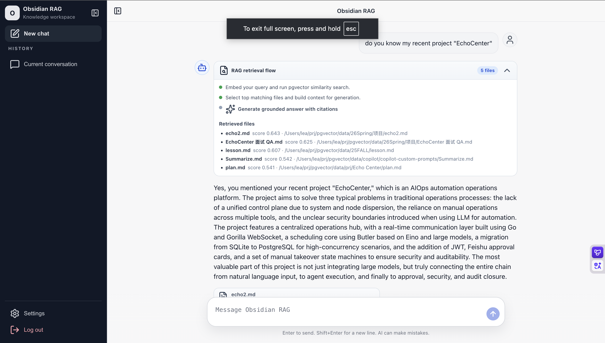

# Obsidian RAG

一个面向本地知识库的 RAG 问答系统：把你的 Obsidian/Markdown 文档切片入库到 pgvector，基于语义检索生成有引用来源的回答。



## 项目说明

这个项目提供一套可直接运行的端到端 RAG 应用，包含：

- 前端：React + TypeScript + Vite
- 后端：FastAPI + LangGraph + SQLAlchemy
- 向量数据库：PostgreSQL + pgvector
- 模型接入：OpenAI 兼容接口 / Ollama

你可以在 Web 页面里直接提问，系统会展示：

- 检索流程可视化（可折叠）
- 检索到的文件列表与相关度
- 最终回答引用了哪些文件

## 数据流（提示词到输出）

1. 用户在前端输入问题，调用 `/api/v1/chat/stream`
2. 后端对问题做向量化，使用 pgvector 在 `documents` 中检索 Top-K 相关片段
3. 将检索到的上下文拼接到系统提示词（system prompt）
4. 带上会话历史调用聊天模型进行流式生成
5. 通过 SSE 持续返回：`conversation`、`trace`、`message`、`sources`、`done`
6. 前端实时渲染回答，并展示引用文件和检索流程

## 目录结构

```text
backend/
  src/
    api/        # FastAPI 路由（auth/chat/ingest/settings/history）
    graph/      # LangGraph 工作流与节点
    services/   # 向量检索、embedding、解析、切片、配置等
frontend/
  src/
    components/ # 聊天组件、来源卡片、RAG 流程面板
    hooks/      # SSE 聊天流处理
```

## 环境要求

- Node.js 18+
- Python 3.11+
- Docker / Docker Compose
- Make

## 快速启动

1. 安装依赖并初始化环境：

```bash
make install
```

2. 启动数据库：

```bash
docker-compose up -d
```

3. 初始化数据库和 pgvector 扩展：

```bash
cd backend
source venv/bin/activate
python -m src.services.init_db
```

4. 启动前后端：

```bash
make dev
```

- 前端：http://localhost:5173
- 后端：http://localhost:8000

## 关键配置（.env）

请至少检查以下变量：

- `POSTGRES_HOST` `POSTGRES_PORT` `POSTGRES_USER` `POSTGRES_PASSWORD` `POSTGRES_DB`
- `ADMIN_USERNAME` `ADMIN_PASSWORD` `SECRET_KEY`
- `CHAT_API_BASE` `CHAT_API_KEY` `CHAT_MODEL`
- `EMBEDDING_API_BASE` `EMBEDDING_API_KEY` `EMBEDDING_MODEL` `EMBEDDING_DIM`
- `OBSIDIAN_VAULT_PATH`（可在前端设置页覆盖）

## 导入知识库（Ingest）

你可以在前端 Settings 中触发，也可以直接走 API：

```bash
curl -X POST http://localhost:8000/api/v1/ingest \
  -H "Authorization: Bearer <TOKEN>" \
  -H "Content-Type: application/json" \
  -d '{"directory_path":"data"}'
```

系统会自动切片、向量化并写入 `documents`，并带有防重复入库逻辑。

## 当前特性

- 流式回答（SSE）
- 会话级历史上下文
- RAG 检索流程可视化（可折叠）
- 引用文件清晰展示（文件名、路径、相关度）
- 文档去重入库（指纹机制）

## 常见问题

1. 为什么回答里没有我想要的项目内容？
   - 先确认相关文档已导入并成功入库，再检查检索到的文件列表。

2. 为什么会命中不相关文档？
   - 可调整 embedding 模型、切片策略、Top-K 或增加低相关度拒答阈值。

3. 为什么看不到后端日志？
   - 使用 `make dev` 启动，后端默认开启 access log 与请求日志。
