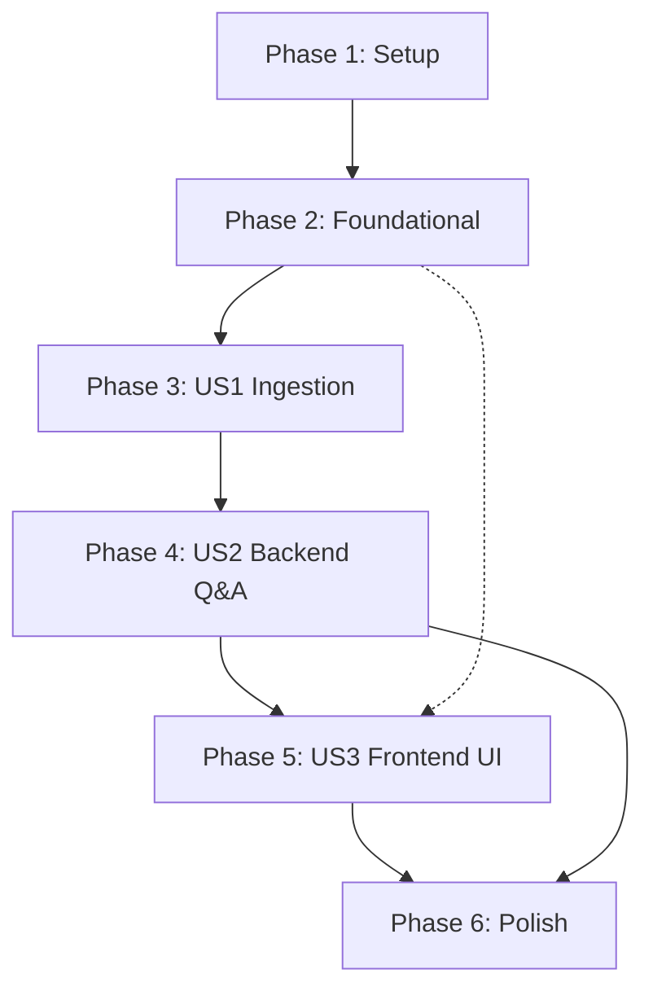

# Implementation Tasks: Obsidian RAG System

**Branch**: `001-obsidian-rag-system` | **Plan**: [plan.md](./plan.md)

## Phase 1: Setup
*Goal: Initialize the project structure and foundational boilerplate for both frontend and backend.*

- [x] T001 Initialize backend Python project and install core dependencies (FastAPI, LangGraph, pgvector, pytest) in `backend/`
- [x] T002 [P] Initialize frontend React project with Vite, TailwindCSS, and Jest in `frontend/`
- [x] T003 Create `backend/requirements.txt` with locked dependencies
- [x] T004 Create `backend/src/api/main.py` with basic FastAPI app shell
- [x] T005 [P] Setup TailwindCSS configuration in `frontend/tailwind.config.js` and `frontend/src/index.css`
- [x] T006 Create root `Makefile` with `dev` target to start both frontend and backend servers
- [x] T007 Create `docker-compose.yml` in root to easily spin up a local PostgreSQL instance with pgvector for development
- [x] T008 [P] Initialize `.env.example` in root with required environment variables

## Phase 2: Foundational 
*Goal: Establish database connection, base models, and core LangGraph setup.*

- [x] T009 Set up database connection logic in `backend/src/services/db.py`
- [x] T010 Implement SQLAlchemy models for `Document`, `Conversation`, and `Message` based on data-model in `backend/src/models/db_models.py`
- [x] T011 Create database migration script or simple setup script to initialize tables and `vector` extension in `backend/src/services/init_db.py`
- [x] T012 Define LangGraph state schema for the RAG workflow in `backend/src/graph/state.py`

## Phase 3: User Story 1 - Document Ingestion & Vector Setup
*Goal: System can ingest Obsidian notes and store their vector representations.*
*Independent Test Criteria: Can run a script to process a folder of markdown files and verify they are stored in the database with vector embeddings.*

- [x] T013 [US1] Implement document parsing logic to extract content and metadata from Obsidian markdown files in `backend/src/services/parser.py`
- [x] T014 [US1] Implement chunking strategy for long documents in `backend/src/services/chunker.py`
- [x] T015 [US1] Implement embedding generation using a chosen model (e.g., OpenAI or local sentence-transformers) in `backend/src/services/embedder.py`
- [x] T016 [US1] Implement function to save parsed chunks and embeddings to PostgreSQL via pgvector in `backend/src/services/db_storage.py`
- [x] T017 [US1] Create a CLI script or API endpoint to trigger ingestion of a specified directory in `backend/src/api/ingest.py`
- [x] T018 [US1] Write integration test for the full ingestion pipeline in `backend/tests/test_ingestion.py`

## Phase 4: User Story 2 - Basic RAG Q&A (Backend)
*Goal: Users can ask questions and receive answers based on their ingested notes via API.*
*Independent Test Criteria: Can send a POST request to `/api/v1/chat/stream` and receive a streamed SSE response with contextually relevant answers.*

- [x] T019 [US2] Implement vector similarity search query against the `Document` table in `backend/src/services/vector_search.py`
- [x] T020 [US2] Implement the retrieval node for LangGraph to fetch relevant context based on user query in `backend/src/graph/nodes/retrieve.py`
- [x] T021 [US2] Implement the generation node for LangGraph using an LLM to answer based on context in `backend/src/graph/nodes/generate.py`
- [x] T022 [US2] Assemble the nodes into the main LangGraph workflow in `backend/src/graph/workflow.py`
- [x] T023 [US2] Implement the `/api/v1/chat/stream` endpoint in `backend/src/api/routes/chat.py` to yield SSE events from the LangGraph execution
- [x] T024 [US2] Implement the `/api/v1/conversations/{conversation_id}/messages` endpoint to retrieve history in `backend/src/api/routes/history.py`
- [x] T025 [US2] Write tests for the retrieval logic and graph execution in `backend/tests/test_graph.py`

## Phase 5: User Story 3 - Interactive Frontend Q&A Interface
*Goal: Users can interact with the RAG system through a polished React UI.*
*Independent Test Criteria: User can open the web interface, type a question, see the streaming response, and view cited sources.*

- [x] T026 [P] [US3] Create base layout component (header, main content area, sidebar for history) in `frontend/src/components/Layout.tsx`
- [x] T027 [P] [US3] Create a `ChatInput` component for user query submission in `frontend/src/components/ChatInput.tsx`
- [x] T028 [P] [US3] Create a `ChatMessage` component to display individual messages (user and assistant) in `frontend/src/components/ChatMessage.tsx`
- [x] T029 [US3] Implement API client utility for fetching conversation history in `frontend/src/api/client.ts`
- [x] T030 [US3] Implement custom hook `useChatStream` to handle SSE connection and state updates for streaming responses in `frontend/src/hooks/useChatStream.ts`
- [x] T031 [US3] Assemble main chat interface in `frontend/src/pages/ChatPage.tsx` integrating input, message list, and the SSE hook
- [x] T032 [US3] Implement display of source snippets in the `ChatMessage` component when provided by the backend in `frontend/src/components/SourceSnippet.tsx`

## Phase 6: Polish & Cross-Cutting Concerns
*Goal: Ensure code quality, consistent UX, and robust error handling.*

- [x] T033 Add comprehensive error handling in the FastAPI endpoints (e.g., database connection failures, invalid LLM responses)
- [x] T034 Add UI loading states, error boundaries, and empty state designs in the React application
- [x] T035 Ensure strict adherence to TailwindCSS design tokens for consistent spacing and typography across components
- [x] T036 Run backend linting (flake8/black) and resolve all warnings
- [x] T037 Run frontend linting (ESLint) and resolve all warnings
- [x] T038 Update root `README.md` with final instructions on how to use the ingestion tool and start the app

## Dependencies

## Parallel Execution Examples

- **Phase 1**: Backend setup (T001, T003, T004) can run parallel to frontend setup (T002, T005).
- **Phase 3 vs Phase 5**: While backend engineers build the ingestion and RAG logic (Phase 3 & 4), frontend engineers can build the UI components (T026-T028) using mock data.

## Implementation Strategy

We will follow an MVP-first approach. Phase 3 (Ingestion) and Phase 4 (Backend API) represent the core technical value. Phase 5 connects it to the user. We recommend completing P1 -> P4 sequentially to ensure the core data pipeline works before wiring up the frontend.